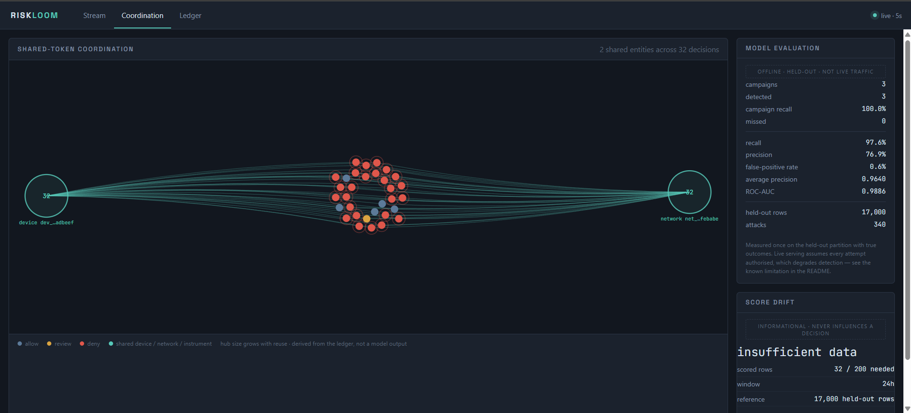
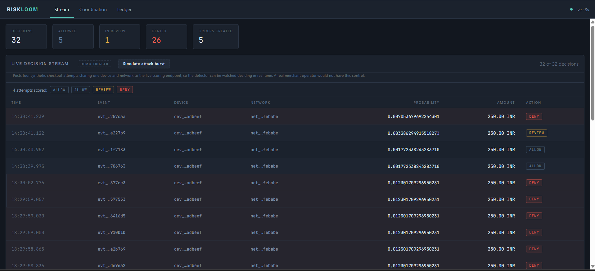
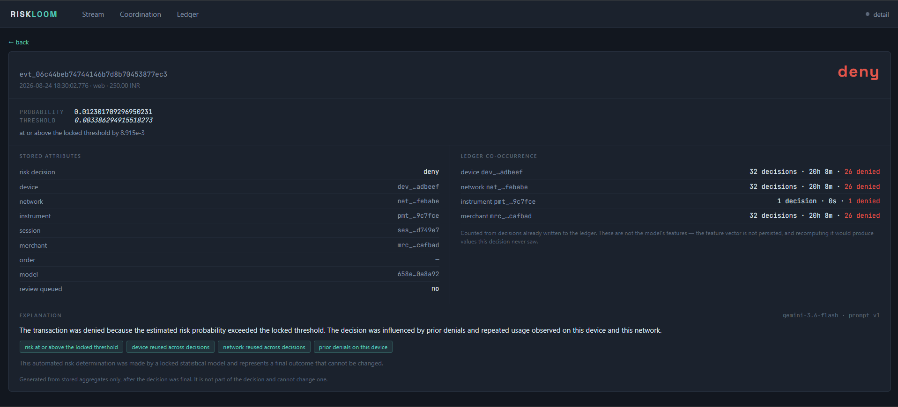
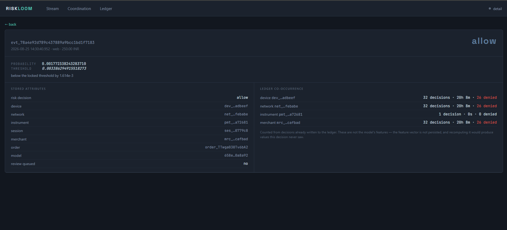
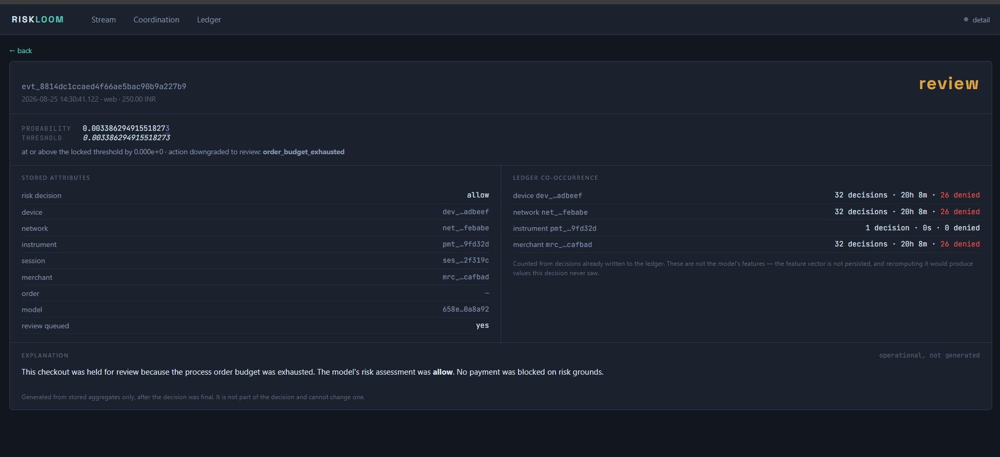
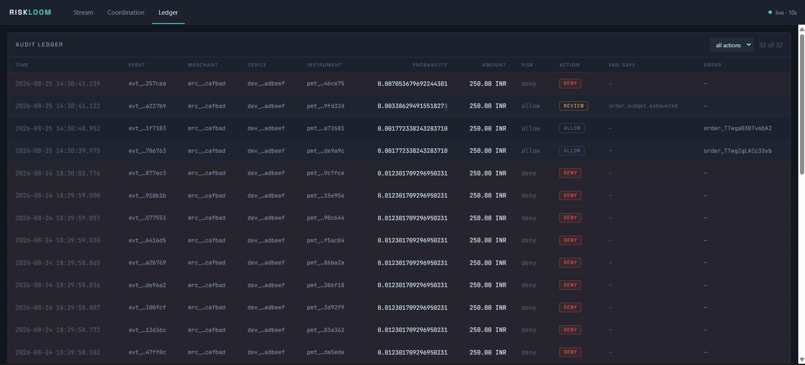

<div align="center">

# RiskLoom

### Detect coordinated card testing before a checkout becomes a loss

[](https://razorpay.com/buildathon)


**Live checkout scoring · campaign coordination · explainable decisions · append-only audit trail**

[Results](#held-out-evaluation) · [How it works](#how-it-works) · [Run locally](#run-locally) · [Safety](#safety-by-design) · [Limitations](#what-testing-revealed)

</div>

<p align="center">
  
</p>

<p align="center"><sub>A shared-signal view of 32 live decisions, with locked held-out model metrics shown separately from live traffic.</sub></p>

## Why RiskLoom

Card-testing attempts often look harmless in isolation. The amounts are small, the instruments keep changing, and each checkout can resemble an ordinary failure. The pattern becomes visible only when activity is connected across devices, sessions, networks, instruments, merchants, and time.

RiskLoom finds that coordination while a checkout is still in progress. It computes 75 causal temporal features, scores the attempt with a locked calibrated model, returns `ALLOW`, `REVIEW`, or `DENY`, and records the evidence behind the outcome. Operators can watch the pattern form in real time without giving an LLM or dashboard control over the decision.

RiskLoom is defense-only and shadow-mode by construction. It uses synthetic data and Razorpay test mode. It never captures, refunds, settles, or modifies a payment.

## What it does

- Scores a checkout before Razorpay order creation.
- Detects repeated infrastructure and coordinated activity over time.
- Keeps feature computation causal through a compute-before-update state engine.
- Loads the selected model from strict JSON rather than pickle or joblib.
- Writes every final decision to an append-only audit ledger.
- Shows decisions, shared-token coordination, model evaluation, and drift diagnostics on one dashboard.
- Generates explanations only after a decision is final.

An `ALLOW` can create a capped Razorpay test-mode order. `REVIEW` and `DENY` create no order. There is deliberately no public order-creation endpoint.

## Held-out evaluation

The final model, calibrator, feature order, threshold, and cost policy were locked before the chronological test period was opened. Nothing was refit after evaluation.

| Metric | Result |
| --- | ---: |
| Test rows | 17,000 |
| Attack events | 340 |
| Campaign recall | **100% (3/3)** |
| Event recall | **97.65%** |
| Precision | **76.85%** |
| Average precision | **96.40%** |
| ROC-AUC | **98.86%** |
| False-positive rate | **0.60%** |
| Configured policy cost | **300 units** |

### Confusion matrix

| Actual class | Predicted attack | Predicted legitimate |
| --- | ---: | ---: |
| Attack | **332** | 8 |
| Legitimate | 100 | **16,560** |

The policy cost is `false positives × 1 + false negatives × 25`. These are transparent decision weights, not estimates of merchant losses in rupees.

All results come from deterministic synthetic data. They demonstrate the behavior of this implementation under its documented data model, not production fraud accuracy.

## Product walkthrough

### A coordinated burst changes the decision

The dashboard can post a local synthetic burst through the same preflight endpoint used by normal requests. Reuse accumulates across the shared device and network, and the sequence moves from `ALLOW` to `REVIEW` and then `DENY`.



### A decision remains inspectable

The detail view separates the locked model result from the final action, lists only stored pseudonymous attributes, and shows prior ledger co-occurrence. The explanation is generated from stored aggregates after the decision is final and cannot change it.



<details>
<summary>View ALLOW and REVIEW decision examples</summary>

#### Allowed checkout

The model score remains below the locked threshold and a capped test-mode order is created.



#### Review fallback

The model result is preserved separately from the operational action. In this example, order-budget exhaustion safely downgrades the action to `REVIEW`.



</details>

### The ledger preserves the final record

The read-only ledger brings together the model risk, final action, fail-safe reason, test order reference, and pseudonymous entity tokens. Repeated requests remain idempotent rather than creating a second effect.



## How it works

```text
Razorpay test-mode checkout
          │
          ▼
  Checkout preflight API
          │
          ├── validate request and merchant scope
          ├── resolve prior temporal state
          └── compute 75 causal features
                         │
                         ▼
                 Locked JSON model
                 + Platt calibrator
                 + locked threshold
                         │
                         ▼
                ALLOW / REVIEW / DENY
                         │
             ┌───────────┴───────────┐
             ▼                       ▼
      Append-only ledger       Explanation job
             │                 current decision excluded
             ├───────────────┐       │
             ▼               ▼       ▼
       Operator dashboard  Coordination graph  LLM explanation
```

Four boundaries keep the result reproducible and auditable:

1. **Causal state:** an event is scored from observations that existed before it; the current event is added only afterward.
2. **Chronological isolation:** training, calibration fitting, policy selection, and final test are separate periods with separate interfaces.
3. **Portable inference:** the model is validated JSON data with no arbitrary code-loading surface.
4. **Explanation isolation:** Gemini receives allowlisted aggregates after the outcome and has no path back to scoring or payment behavior.

## Run locally

### Requirements

- Docker Desktop with Compose
- [`uv`](https://docs.astral.sh/uv/)
- The generated development artifact bundle
- Razorpay test credentials only for creating actual test-mode orders
- Optional Gemini API access for generated explanations

The generated model and feature artifacts are deliberately excluded from Git. Place the supplied bundle at the documented repository paths before starting the stack.

```powershell
git clone https://github.com/XxSURYANSHxX/riskloom.git
cd riskloom

uv sync --frozen
uv run python scripts/preflight_check.py

Copy-Item .env.example .env
docker compose up --build -d
```

Open the dashboard:

```text
http://127.0.0.1:8000/dashboard
```

Check readiness:

```powershell
Invoke-RestMethod http://127.0.0.1:8000/health/ready
```

The placeholders in `.env.example` are sufficient for startup. Real Razorpay test credentials are needed only when an `ALLOW` should create a test order. Never commit `.env`.

<details>
<summary>API surface</summary>

| Method | Route | Purpose |
| --- | --- | --- |
| `GET` | `/health/live` | Process liveness |
| `GET` | `/health/ready` | PostgreSQL readiness |
| `POST` | `/api/v1/webhooks/razorpay` | Verified Razorpay webhook intake |
| `POST` | `/api/v1/checkout/preflight` | Score one checkout attempt |
| `GET` | `/api/v1/dashboard/summary` | Decision and outcome summary |
| `GET` | `/api/v1/dashboard/decisions` | Paged audit ledger |
| `GET` | `/api/v1/dashboard/decisions/{id}` | One decision with ledger context |
| `GET` | `/api/v1/dashboard/coordination` | Shared-token graph |
| `GET` | `/api/v1/dashboard/model` | Locked model metadata and held-out aggregates |
| `GET` | `/api/v1/dashboard/drift` | Informational PSI diagnostics |
| `GET` | `/api/v1/dashboard/decisions/{id}/explanation` | Read an explanation |
| `POST` | `/api/v1/dashboard/decisions/{id}/explanation` | Generate one explanation enrichment row |

</details>

## Safety by design

- Live-mode Razorpay keys are rejected at startup.
- Webhooks are verified against their exact raw bytes before parsing.
- Stored identifiers are strict synthetic or pseudonymous tokens.
- Raw card details, credentials, full payloads, and PII are never sent to Gemini.
- LLM output is explanation only and cannot become model evidence or decision authority.
- Adversarial testing is local, synthetic, and unable to contact an external target.
- Database failures never produce an unbacked `ALLOW`.
- The dashboard is read-only apart from explanation enrichment, which cannot alter a decision.

## What testing revealed

The complete measurements and failure narratives are preserved in [`docs/BUILD_LOG.md`](docs/BUILD_LOG.md). The most important open boundaries are summarized here.

| Test | Finding | Current response |
| --- | --- | --- |
| Boundary-spaced evasion | Recall fell to **0.00-0.12**; exact 3,600-second spacing detected **0/120** attack events | Kept the locked model unchanged, published the failure, and scoped longer-horizon and spacing-aware features for a future schema |
| Live-state replay | Recall moved from **0.856 to 0.600** and policy cost from **763 to 2,279** under live-serving assumptions | Offline held-out metrics are never presented as measured live accuracy |
| Threshold ties | The locked threshold sits one floating-point step above an eight-row probability cluster | Portable inference parity and a non-fatal boundary diagnostic are tested |
| Midrange calibration | Middle probability bands are overconfident despite low overall ECE | Reliability tables remain visible and no test-tuned recalibration was performed |
| Candidate policy | A lower-cost banded policy exceeded the false-positive ceiling | Activation was refused and the incumbent threshold remained locked |
| Frozen database | Failure remains safe, but latency is not fully bounded when a socket stays open without responding | The API returns `503`; the timeout limitation remains documented |

Operationally, this is still a local shadow-mode build: endpoints are unauthenticated, live feature state is per process, review items are not resolvable through a workflow, and the coordination graph is a shared-token projection rather than a second campaign classifier.

## Verification

```powershell
uv lock --check
uv run ruff format --check .
uv run ruff check .
uv run mypy src
uv run pytest --cov=riskloom --cov-report=term-missing --cov-fail-under=90
uv run alembic check
```

Integration tests use disposable PostgreSQL and fake every Razorpay and Gemini call. The suite enforces at least 90% branch-aware coverage.

<details>
<summary>Locked artifact hashes</summary>

| Artifact | SHA-256 |
| --- | --- |
| `model.json` | `3db8dafef643261c0df559cab632cfaf6fc45be54f38c1f4a621ef5af84039d4` |
| `training_report.json` | `4ff96556f1df49d7c44c29703c328753a6ea0ef197410976100e84751943ea6d` |
| `manifest.json` | `00aa16380eee1dcfa26fe9c89ed0eb8f866e75e98bd7a7ba89f9cc228c792f2e` |
| `evaluation.json` | `11251cef0dade5d14d2d1a85fe3822126e01c2a354494dd09b720c679244c40d` |

</details>

## Technology

- **Serving:** FastAPI, Pydantic, SQLAlchemy, Alembic, PostgreSQL
- **Modeling:** NumPy, scikit-learn, strict local JSON inference
- **Payments:** Razorpay test-mode orders and verified webhooks
- **Explanations:** Gemini behind a non-authoritative enrichment boundary
- **Operations:** Docker Compose, `uv`, Ruff, mypy, pytest

## Further reading

- [`docs/BUILD_LOG.md`](docs/BUILD_LOG.md) contains the complete engineering, evaluation, and failure record.
- [`AGENTS.md`](AGENTS.md) defines the repository's durable safety and implementation rules.
- [`.env.example`](.env.example) documents the local configuration surface.
- [Razorpay AI Buildathon](https://razorpay.com/buildathon) contains the Track 02 brief.

## License

RiskLoom is available under the [MIT License](LICENSE).
