# RiskLoom system architecture

RiskLoom is a defense-only, shadow-mode checkout risk manager. Its deterministic scoring path,
operational fail-safes, external test-mode operations, post-decision explanations, and audit views
are deliberately separate. The diagram below follows the implemented paths and their failure
boundaries.

```mermaid
flowchart TB
    subgraph runtime["Runtime decision path"]
        direction TB
        checkout["Synthetic or local test checkout attempt<br/>typed pseudonymous input"]
        validate["Validate request and merchant scope<br/>no caller timestamp or outcome"]
        claim["Claim event_id in PostgreSQL<br/>before touching causal state"]
        duplicate{"event_id already claimed?"}
        replay["Final row: return stored result<br/>Pending row: return 409"]
        timestamp["Assign strictly increasing server time<br/>reject non-monotonic engine input"]
        prior_state["Process-wide locked prior state<br/>current attempt is absent"]
        features["Unmodified causal FeatureEngine<br/>75 temporal features, compute then update"]
        model["SHA-256-pinned locked JSON model<br/>plus Platt calibration"]
        probability["Calibrated risk probability p<br/>full float64 value"]
        threshold["Compare p with the single locked<br/>full-float64 decision threshold"]
        risk{"Binary model judgment"}
        allow["ALLOW"]
        deny["DENY"]
        safety["Operational safety layer<br/>reserve capped order-attempt budget"]
        orders_adapter["Internal typed Razorpay Orders adapter<br/>amount, currency, derived receipt only"]
        review["REVIEW<br/>operational fail-safe, not a model class"]
        no_order["No Razorpay order"]
        finalize["Finalize audit row<br/>model id, p, threshold, risk decision,<br/>action, safety reason, test order id"]

        checkout --> validate --> claim --> duplicate
        duplicate -->|yes| replay
        duplicate -->|no| timestamp --> prior_state --> features --> model --> probability --> threshold --> risk
        risk -->|p below threshold| allow --> safety
        risk -->|p at or above threshold| deny --> no_order --> finalize
        features -. feature failure .-> review
        model -. scoring failure .-> review
        safety -->|budget available| orders_adapter --> order_api
        safety -->|budget exhausted| review
        order_api -->|order created| finalize
        order_api -->|timeout or rejection| review
        review --> no_order
    end

    subgraph external["External services"]
        direction TB
        webhook_source["Razorpay-style webhook sender"]
        order_api["Razorpay Test Orders API<br/>POST /v1/orders only"]
        gemini_api["Gemini API<br/>explanation generation only"]
    end

    subgraph audit["Audit and investigation"]
        direction TB
        raw_verify["Verify HMAC-SHA256 over exact raw bytes<br/>before JSON parsing"]
        webhook_dedupe{"X-Razorpay-Event-Id<br/>already stored?"}
        webhook_duplicate["Audit duplicate<br/>no second business effect"]
        projection["Parse only after verification<br/>allowlist and redact audit projection"]
        delivery["Append webhook event and observation<br/>atomically as delivered; never replay<br/>into live feature state"]
        ledger["PostgreSQL append-only evidence<br/>pseudonymous decisions and sanitized webhooks"]
        dashboard["Read-only investigator dashboard<br/>stored decisions and offline aggregates"]
        coordination_graph["Deterministic campaign coordination graph<br/>built from ledger co-occurrence"]
        drift["Read-only PSI drift monitor<br/>minimum 200 scored observations<br/>no effect on any individual decision"]
        explanation_gate{"Human requests explanation<br/>for a finalized DENY?"}
        allowlisted["Allowlisted recorded evidence only<br/>numbers, booleans, closed enums;<br/>current decision excluded from prior context"]
        validated_explanation["Validate schema, factor codes,<br/>grounding, and exact supplied numbers"]
        explanation_store["Additive explanation row only<br/>cannot modify decision or action"]

        webhook_source --> raw_verify --> webhook_dedupe
        webhook_dedupe -->|yes| webhook_duplicate --> ledger
        webhook_dedupe -->|no| projection --> delivery --> ledger
        finalize --> ledger
        ledger --> dashboard
        ledger --> coordination_graph --> dashboard
        ledger --> drift --> dashboard
        ledger --> explanation_gate
        explanation_gate -->|eligible and requested| allowlisted --> gemini_api --> validated_explanation --> explanation_store --> dashboard
        explanation_gate -->|not a final DENY| no_explanation["No Gemini call"]
    end

    subgraph offline["Offline model lifecycle"]
        direction TB
        simulator["Deterministic synthetic-data generator<br/>UUIDv5 identities and seeded PRNG streams"]
        synthetic["Canonical synthetic events<br/>separate ground-truth labels"]
        extraction["Causal offline feature extraction<br/>same 75-feature schema as serving"]
        partitions["Strict chronological isolation<br/>train -> calibration fit -> policy selection -> held-out test"]
        train["Fit preprocessing and candidates<br/>on train only"]
        calibrate["Fit Platt calibration<br/>on calibration-fit only"]
        select_policy["Select candidate and one threshold<br/>on policy-selection only"]
        locked["Locked portable model, calibrator,<br/>feature order, threshold, and manifests"]
        held_out["Fit-free portable inference<br/>on chronologically later held-out test"]
        evaluation["Pinned aggregate evaluation artifact<br/>offline synthetic evidence only"]
        bundle["Immutable runtime bundle contract<br/>five source-pinned SHA-256 hashes"]

        simulator --> synthetic --> extraction --> partitions
        partitions --> train --> calibrate --> select_policy --> locked
        partitions --> held_out
        locked --> held_out --> evaluation
        locked --> bundle --> model
        evaluation --> bundle
        evaluation -. locked reference bins .-> drift
    end

    subgraph failure["Failure and recovery paths"]
        direction TB
        storage_failure["Storage unavailable during claim<br/>or finalization"]
        unavailable["Return 503 storage_unavailable<br/>never present partial state as complete"]
        post_order_failure["Storage fails after a test order exists<br/>log the Razorpay order ID"]
        manual["Manual reconciliation required<br/>no automatic pending-row recovery"]
        raw_reject["Invalid signature or oversized body<br/>reject before parsing or persistence"]

        claim -. storage failure .-> storage_failure --> unavailable
        finalize -. storage failure before order .-> storage_failure
        order_api -. order exists but final write fails .-> post_order_failure --> unavailable
        post_order_failure --> manual
        raw_verify -. verification failure .-> raw_reject
    end

    gemini_api -. no Razorpay credentials or money operations .-> no_payment_capability["Boundary enforced by package isolation"]
```

## System overview

The live preflight API first claims the pseudonymous event ID in PostgreSQL, then assigns a
strictly increasing server timestamp and passes the attempt through the one long-lived Day 3
feature engine. The engine derives exactly 75 features from prior in-memory state and updates that
state only after the feature record has been constructed. A source-pinned portable JSON model
produces the calibrated probability; its single locked threshold produces the only two risk
decisions, `ALLOW` and `DENY`.

Razorpay-style webhooks are a separate audit-ingestion path. RiskLoom verifies the signature over
the exact raw bytes before parsing, deduplicates on `X-Razorpay-Event-Id`, and atomically stores a
sanitized event projection and normalized observation. Delayed or out-of-order webhook delivery is
not replayed into the live FeatureEngine, so it cannot retroactively change an earlier score.

## Risk-decision boundary

The locked calibrated model and its one threshold are the sole risk authority. The comparison is
made with the full float64 probability and the full float64 threshold loaded from `model.json`, not
the rounded audit-column value. A value below the threshold is `ALLOW`; a value equal to or above
it is `DENY`. No policy band, dashboard value, PSI result, Gemini output, or Razorpay response can
enter this calculation. Exact train/serve parity is checked across all 75 features.

## Operational-safety boundary

`REVIEW` is not a third prediction or a second threshold. It is the recorded operational outcome
when feature computation, scoring, order creation, or the per-process order-attempt budget prevents
safe completion. The safety layer may downgrade a model `ALLOW` to `REVIEW`; it cannot turn a
`DENY` into an order. A review item remains pending because this repository intentionally has no
review-resolution mutation workflow.

## Gemini/LLM boundary

Gemini is lazy, human-requested enrichment for a row whose `status` is already `final` and whose
risk decision is already `DENY`. Its input schema contains only already-recorded numbers, booleans,
and closed enums; pseudonymous entity tokens and the current decision itself are excluded from the
prior co-occurrence context. The returned JSON is schema-checked, grounded against the supplied
facts, and stored in a separate additive table.

The explanation package is isolated from the decision path and from database persistence. Gemini
cannot change the probability, threshold, risk decision, action, order identifier, or review state.
It has its own API key, has no Razorpay credentials, and has no capture, refund, settlement, order,
or other money-operation capability. Failure affects only the explanation attempt.

## External payment-operation boundary

Only the internal Razorpay Orders adapter can create an order, only with a key ID beginning
`rzp_test_`, and only after the model returned `ALLOW` and the process order-attempt budget was
reserved. The adapter receives amount, currency, and a derived receipt; it does not receive card
data. `DENY`, `REVIEW`, feature failure, scoring failure, and budget exhaustion create no order.
RiskLoom never captures, refunds, settles, or modifies a payment and exposes no public order-creation
endpoint.

## Audit and evidence model

The PostgreSQL ledger allows one pending-to-final transition and is append-only after finalization,
separating the model judgment from the operational outcome. A final decision row records
pseudonymous checkout attributes plus the model ID, calibrated
probability, locked threshold, binary risk decision, final action, fail-safe reason, feature
artifact identities, and optional Razorpay test-order ID. The dashboard reads those stored rows;
it does not recompute features or scores.

The deterministic coordination graph is also a read-only projection. It connects decisions through
stored pseudonymous device, network, instrument, and merchant co-occurrence, and its server-side
layout carries no risk semantics. Offline evaluation aggregates are visibly separate from live
ledger evidence.

## Offline model lifecycle

The generator publishes deterministic, canonical synthetic events and a separate label stream.
Offline feature extraction consumes the event stream causally through the same 75-feature schema.
The development timeline is isolated into train, calibration-fit, policy-selection, and
chronologically later held-out test periods. Preprocessing and candidates fit on train only; Platt
calibration fits on calibration-fit only; candidate and threshold selection use policy-selection
only. The official held-out evaluation is a separate fit-free portable-inference command.

The deployed model is data-only JSON, not pickle or executable estimator state. Model identity,
feature order, calibration, threshold, source manifests, and evaluation are bound by SHA-256. The
runtime installer accepts only five approved source-pinned artifact paths and verifies them before
startup binding.

## Verified held-out evaluation evidence

These are **offline results on 17,000 chronologically later synthetic test events**, not live
traffic, production accuracy, or live-serving accuracy. The locked evaluation artifact reports:

| Quantity | Verified result |
| --- | ---: |
| Test events | 17,000 |
| Attack events | 340 |
| Campaigns detected | 3 / 3 |
| Attack events detected | 332 / 340 |
| Recall | 97.65% |
| Precision | 76.85% |
| False-positive rate | 0.60% |
| Average precision | 96.40% |
| ROC-AUC | 98.86% |
| False positives | 100 |
| True negatives | 16,560 |

The exact floating-point values and confusion counts are in the installed
[`evaluation.json`](../artifacts/evaluations/development/evaluation.json), whose SHA-256 is pinned by
[`runtime_bundle.py`](../src/riskloom/runtime_bundle.py). Because live preflight does not yet know
an attempt's eventual outcome, these held-out values must not be presented as live-serving
accuracy; that quantified limitation is documented in the
[build log](BUILD_LOG.md#known-limitation-live-serving-accuracy-is-not-measured-to-held-out-standard).

## Drift-monitoring boundary

PSI compares recent stored calibrated probabilities with the per-bin distribution already
published in the held-out evaluation artifact. It is read-only, reports no PSI value or band below
200 scored observations, and exposes every per-bin contribution. It never reopens the held-out
event rows and has no path into a decision, threshold, model parameter, or ledger write.

## Failure semantics and recovery limits

- A duplicate final preflight event returns the stored result without advancing causal state or
  creating another order. A duplicate still marked `pending` returns `409`; there is no automatic
  recovery of a crashed pending request.
- Callers cannot inject stale timestamps. The server assigns strictly increasing event times under
  the process-wide feature-state lock, and the engine independently rejects non-monotonic input.
- Invalid webhook signatures and oversized bodies are rejected before JSON parsing. A duplicate
  provider event is audited without a second business effect.
- Feature or scoring failure produces `REVIEW`. Razorpay order failure or budget exhaustion
  converts a model `ALLOW` to `REVIEW`; none of those paths creates a completed order response.
- A PostgreSQL failure during claim or finalization returns `503 storage_unavailable`. An
  unrecorded or partially recorded decision is never presented to the caller as complete.
- One unavoidable distributed-systems window remains: a Razorpay test order can be created before
  the final ledger write fails. RiskLoom returns `503`, logs `preflight_ledger_write_failed` with
  the test-order ID, and requires manual reconciliation. It does not claim atomicity across
  Razorpay and PostgreSQL and performs no automatic recovery.
- Live feature state is in memory and is cold after process restart. Webhook-driven outcome
  reconciliation is future work, not an implemented recovery path.

## Trust boundaries

"Raw payment data" below means cardholder or instrument details, exact webhook bodies, or other
sensitive provider payload. Typed pseudonymous tokens and allowlisted aggregates do not count as
raw payment data; service credentials remain a separate secret boundary.

| Component | Can make risk decisions? | Can change the final action? | Can create a Razorpay test order? | Can access raw payment data? | Failure behavior |
| --- | --- | --- | --- | --- | --- |
| Locked calibrated model and threshold | Yes; sole binary `ALLOW`/`DENY` authority | Sets the initial matching action but cannot override a later safety fallback | No | No | Scoring failure is recorded as operational `REVIEW` |
| Operational safety layer | No | Yes; may downgrade incomplete or unsafe execution to `REVIEW` | Yes, only by invoking the internal adapter after model `ALLOW` and budget reservation | No | Feature, scoring, budget, or order failure fails safe to `REVIEW` |
| Razorpay Orders adapter | No | No; it only returns an order or a safe failure | Yes; test mode only | No; only amount, currency, and derived receipt | Timeout, rejection, or invalid response becomes `REVIEW`; no automatic retry |
| Gemini explanation layer | No | No | No | No; only allowlisted recorded facts, without tokens or free text | Attempt is failed or rejected; the final decision and payment behavior do not change |
| PostgreSQL ledger | No | No | No | No exact webhook bytes; only pseudonymous decisions and sanitized allowlisted projections | Storage failure returns `503`; post-order failure logs the order ID for manual reconciliation |
| Investigator dashboard | No | No | No | No | Read-only data can be unavailable; no fallback feeds the decision path |
| Webhook signature verifier | No | No | No | Yes, transient exact request bytes in memory only | Invalid signature or oversized body is rejected before parse or storage |
| Causal FeatureEngine | No; it supplies model inputs | No | No | No | Construction failure leaves the current event out of state and leads to `REVIEW` |
| PSI drift monitor | No | No | No | No | Below 200 observations it reports insufficient data; it never changes a decision |

## Security and privacy considerations

- Checkout requests accept strict pseudonymous identifiers rather than PAN, CVV, email, phone,
  VPA, names, addresses, or caller-controlled timestamps and outcomes.
- Webhook HMAC-SHA256 is verified over the exact raw body before parsing. Those bytes exist only in
  request-scoped memory long enough to verify and hash; they are never persisted or logged.
- Webhook storage is an explicit allowlisted and redacted projection. Unknown and free-form fields
  are excluded, and the exact-body SHA-256 digest supports audit without retaining the payload.
- API keys, webhook secrets, signatures, authorization headers, upstream bodies, and provider
  response bodies are never returned, stored in the ledger, or written to logs.
- Razorpay configuration rejects non-test key IDs. Outbound order attempts and Gemini calls have
  separate process caps, and automated tests substitute adapters rather than making real calls.
- Portable JSON inference avoids arbitrary model deserialization. Startup binds the model,
  feature manifest, source contract, feature order, and hashes before the application can serve.

## Implementation evidence

- Runtime orchestration: [`preflight.py`](../src/riskloom/services/preflight.py),
  [`engine_host.py`](../src/riskloom/serving/engine_host.py), and
  [`decisions.py`](../src/riskloom/serving/decisions.py)
- Webhook verification and audit: [`webhooks.py`](../src/riskloom/api/routes/webhooks.py),
  [`signatures.py`](../src/riskloom/integrations/razorpay/signatures.py), and
  [`webhook_ingestion.py`](../src/riskloom/services/webhook_ingestion.py)
- Model binding and distribution: [`model_host.py`](../src/riskloom/serving/model_host.py) and
  [`runtime_bundle.py`](../src/riskloom/runtime_bundle.py)
- Dashboard, graph, and drift: [`dashboard.py`](../src/riskloom/api/routes/dashboard.py),
  [`coordination.py`](../src/riskloom/serving/coordination.py), and
  [`drift.py`](../src/riskloom/services/drift.py)
- Gemini boundary: [`explanations.py`](../src/riskloom/services/explanations.py),
  [`schemas.py`](../src/riskloom/explanations/schemas.py), and
  [`test_isolation.py`](../tests/unit/explanations/test_isolation.py)
- Offline isolation and evaluation: [`data.py`](../src/riskloom/modeling/data.py),
  [`training.py`](../src/riskloom/modeling/training.py), and
  [`evaluation.py`](../src/riskloom/modeling/evaluation.py)
